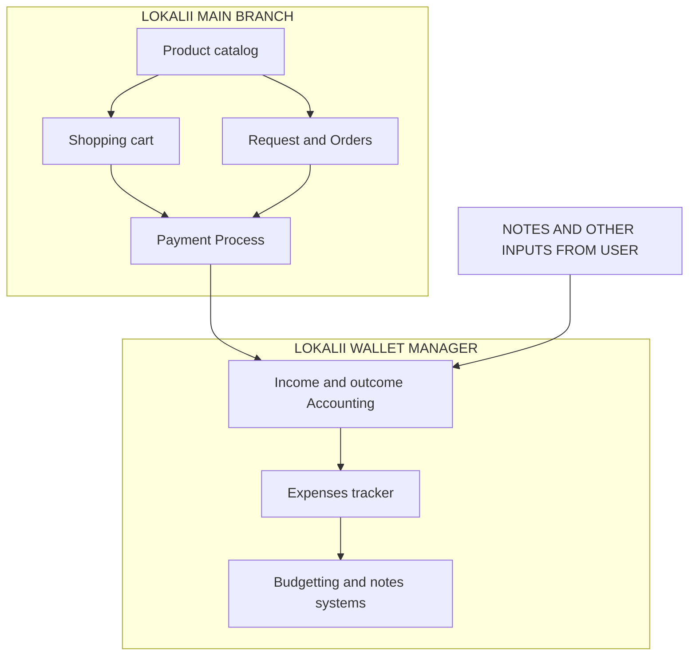
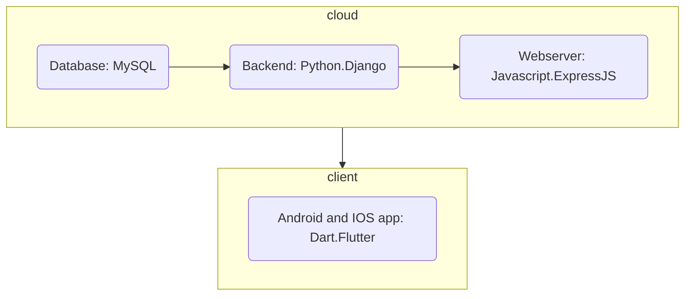

## 1.1 Latar Belakang

- because I see a lot of potential for the economic development of Indonesian society that has not been digitized, due to the 
lack of education and many misconceptions that technology (e-commerce) will kill UMKMs.
Therefore, I created this application called "LOKALII" as a platform so that all layers of traders in Indonesia can contribute to the country's economic turnover, namely by selling on one platform of domestic origin, by the children of the country and for the children of this country.
- To achieve the effectiveness of the industrial revolution 4.0 and the golden Indonesia 2045, economic activists (referred to here as traders) must be open, accustomed to, and understand information technology instead of closing themselves off from the system.
- And for the buyer's side, it will be facilitated because the "LOKALII" application is a social media-based app, which will include recommendations for goods, contents, and services as another function of social media, namely a platform for daily cyberspace interaction between communities.
- Because the main purpose of the "LOKALII" application is economic development, we are very concerned about
how the financial flow of each individual, both sellers and buyers, can run smoothly. Therefore,
we also have one of the main features, namely cashflow management, which is a superior feature compared to other e-commerce. Why? because here both sellers and buyers can pay attention to how much they spend in a certain period of time, along with savings and their savings targets including other financial calculations.
- In the future, "LOKALII" will also facilitate transactions by introducing fintech systems, such as digital wallets that can store LOKALII tokens, money, and also support the paylater systems for ventures (seller features) and for paying goods (buyer features).

## 1.2. Deksripsi Teknologi Informasi

It is a social media-based e-commerce platform that has the following main features:
1. Cashflow management and financial planning
where the seller can record the stock of goods in the store along with the income and expenses of the store with their respective classifications
where buyers can track what products or services they are looking for, as well as their money expenditures and income, at any time they specify
2. content recommendation
content creators can do product marketing
Affiliates can create content to increase the visibility of the products sold
every store can create content
every user can buy products directly from passing posts 
the content algorithm will be adjusted to the interests of buyers and is search-based
Algorithms will recommend products with the best reviews, lowest prices, and closest location to the buyer according to their preferences.
3. social media-based (such as Instagram and TikTok shops)
each user can upload photos, videos, and short videos
each user can communicate with each other via chat
every user can upload stories
every user can recommend products
4. digital walllets
every user can deposit money that can be used in "LOKALII" products
every cash earned by the seller will go to the wallet 
every seller can withdraw their money with every banks that cooperates with "LOKALII"
5. Subscription method
to improve the product and shop exposure
to improve the influencer exposure

## 1.3. Branding

- Merk        : LOKALII
- Tagline     : when there's a will, there's a way!!
- Campaign    : as an application that provide ease of resources management and trades for every seller     
                inside the country and buyer by doing the social-media based e-commerce system.
- Targer user : 1. business owner (preferrably small and rising business, corporates allowed)
                2. active vendors, traders and producer
                3. age 14-65+
                4. influencer and marketing enthusiast
                5. content creator
                6. every layer of indonesian society
- UI UX Theme : 1. easy
                2. simple
                3. interactive
                4. light coloured
                5. slight red, cream, grey, and black colouring
                6. design inspiration taken from tokopedia and pinterest

## 2. User Story

as a | i want to | and so | priorities level
---- | ---- | ---- | ---- 
seller | manage my cashflow | -knowing how much money we made and how much we spent for capital | ⭐⭐⭐⭐⭐
seller | manage my stocks and market price of the product | -knowing when and what to restock with the normal market price | ⭐⭐⭐⭐
buyer | manage my spending | -knowing how much i've spend in a specific period of time based on my own notes | ⭐⭐⭐⭐⭐
buyer | making my own spending categories | -knowing which parts of spending cost me the biggest | ⭐⭐⭐⭐
seller | opening and digitalize my own store | -selling sellers product and empowering the economical cycle and making profits |  ⭐⭐⭐
buyer | buying stuff | -can support the local business, buying the needs and goods, spending money | ⭐⭐⭐
buyer and seller | budgetting the spending of the month | -to limit ourself from being over comsuming etc |⭐⭐⭐⭐

## 3. Struktur Data

## 4. Arsitektur Sistem

## 5. Teknologi, Library, dan Framework

so i've used and will use a few or more Technologies to develop and build LOKALII to it's maximum capacity and prospect and being a fully sustainable apps. In this early phase of development, i've used some kind of technology, including;
- Computational Machine, a borrowed old l2015 laptop with Intel core-i7 inside, along with 8GB of ram and 256GB of SolidStateDrive which can help me boot faster, and extra memory of 1TB by an old HDD
- Smartphone with 2019 main processing unit, sometimes for the emulator.
- Windows 10 as the main OS for the Computing Machine that i use.
- Google, we definetely heard about google and use it a lot to be our sources and tutorials
- YouTube for tutorials and walktrough
- high-level programming language including Dart for Frontend and UI design, Java and Javascript for the web-server, and python for the backend services.
- some of modern day CODE EDITOR such as Visual studio code, Visual Studio, Android Studio, Notepad, and online java compiler.
- with additional design tool called FIGMA (i design everything here) and PENPOT along with CANVA to look up for materials, icons, and plugins for ui design
and i've implemented some of the libraries to make my work more efficient, including;
- PUB flutter
- Animation flutter
- RxDart for flutter
- React for JSL
- FastAPI for python
- Numpy for Python
- Angular for Javascript
- Express.js for Javascript
- JQuery for Javascript
- ReactJs for UI javascript
- Docker library for MySQL
- and many more to the future
with some of programming language mentioned, including Dart, Java, JS, and Pyhton, we expected to use some of frameworks available to support our work including;
- Flutter for Dart
- ReactJS for Javascript
- Django for Pyhton backend
- Visual Studio and VSCODE for every language
- Android Studio for SDK Manager and Android Emulator Provider
- etc coming soon..

  and there are some of technologies, libraries, and framework that i've used and will use along with this development stages, and many more to be explored in the further time..

## 6. Desain User Experience dan User Interface

Splash Screen and user login page for LOKALII;

LOKALII WALLET MANAGER INSPO;

LOKALII Social Media based E-COMMERCE REFFERENCE;

REFERENCE;

REFERENCE;

## 7. Demonstrasi Video

the Mobile app that i've been develope in this meantime;
A social media based app named "LOKALII" which has only 1 feature in this development phase which is;
Money manager; 
track everything from your financial problems including: Income, Outcome, Transaction History, Budgetting,  Spending Graphic, Expenses Tracker, and other features from money manager app.

and we're currently building and scaling this app to fulfill the best use and main purpose from this app in the future, to help local business expand by using information technology, and controls the main economic system of local trades under one app and one management, the insider and the people of Indonesia itself.
fully explained in the upcoming video;

Youtube; 

## 8. Bagaimana mesin komputasi dan sistem operasi berperan dalam produk teknologi informasimu ?

- Sistem dan mesin komputasi tentu sangat amat berpengaruh dalam segala proses pengembangan sebuah aplikasi, mulai dari komputernya itu sendiri, lalu ke bahasa pemrograman, code editor, framework, dan library yang kita gunakan yang mana semuanya berjalan berdasarkan sistem komputasi yang berjalan di alat komputasi (laptop/komputer/handphone) yang kita gunakan.
- Sistem operasi juga banyak menyumbang kemudahan dalam segala proses pengembangan software maupun web bagi para developer karena dengan sistem operasi, kita dapat dengan mudah ber-navigasi di antara ribuan file, program, dan data-data yang ada di dalam, yang disimpan, mauun yang sedang diolah didalam mesin komputasi yang kita gunakan. Tanpa sistem operasi, kita akan kesusahan dalam mencari dan mengakses data, memodifikasi data dan merubahnya ke dalam program yang kita inginkan demi berjalannya aplikasi yang kita develop.
fully explained in teh upcoming video;

youtube;

## 9. Bagaimana algoritma, struktur data, dan bahasa pemrograman berperan dalam produk teknologi informasimu ?

- mari kita mulai bahas dari bahasa pemrograman. Bahasa pemrograman tentu saja dapat sangat berpengaruh dalam pengembangan aplikasi, kenapa? karena bahasa pemrograman itulah sebagai sarana komunikasi kita kepada sang mesin komputasi yang nanti nya akan menjalankan program yang kita buat. Bahasa pemrograman jaman sekarang memudahkan para programmer dan developer dalam bekerja dikarenakan jenis bahasanya yang lebih mudah dipahami oleh manusia, sehingga mempercepat proses pen-kodingan yang dilakukan oleh para developer (karena jika masih menggunakan bahasa mesin murni, kita tentu akan kesusahan dalam memahami nya terlebih karena masih merupakan kode biner). disinilah bahasa pemrograman ikut andil dalam memudahkan kita berkomunikasi sehingga dapat menghasilkan algoritma yang jitu untuk dipahami komputer demi keberlangsungan aplikasi atau program yang kita kembangkan.
- algoritma dan struktur data juga sangat berpengaruh di dalam proses running dan debugging data. Sebagaimana yang kita tahu bahwa program dibaca dan dicompile dari atas ke bawah, struktur data dan algoritma berfungsi dalam menentukan bagian kode mana yang akan dieksekusi terlebih dahulu, kemana kode tersebut bersambung, dan apa yang kode tersebut lakukan beserta akibat dari kode tersebut yang mana akan mengeksekusi kode-kode selanjutnya sesuai algoritma, sehingga terjadi lah rentetan logika yang menjadi basic atau dasar suatu aplikasi dapat bekerja.
fully explained in the upcoming video;

youtube;

## 10. Bagaimana metode pengembangan perangkat lunak / Software Development Life Cycle berperan dalam produk teknologi informasimu ?

- Software development life cycle sangat berpengaruh didalam developing product kali ini, karena sangat memudahkan saya yang tidak tahu apa-apa dan bagaimana proses permulaan dalam perancangan aplikasi.
- Meskipun masih sangat abstrak dan kurang menyeluruh, namun setidaknya proses SDLC ini dapat memberi gambaran akan harus apa kita? di bagian mana kita harus melakukannya? dan bagaimana setelahnya.
- Mulai dari SDLC ini, saya dapat menentukan banyak teknologi, library, dan framework yang akan digunakan dalam proses developing aplikasi mobile kali ini.
fully explained in the upcoming video;

youtube;

## 11. Bagaimana database / sistem basis data berperan dalam produk teknologi informasimu ?

