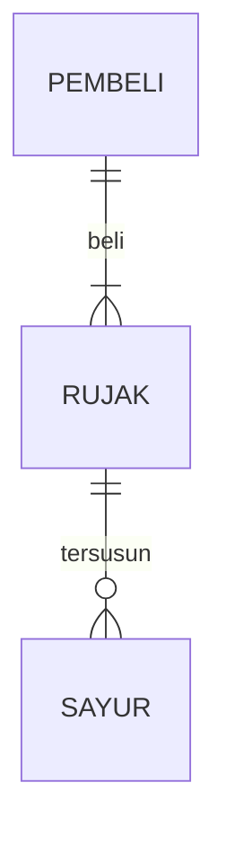
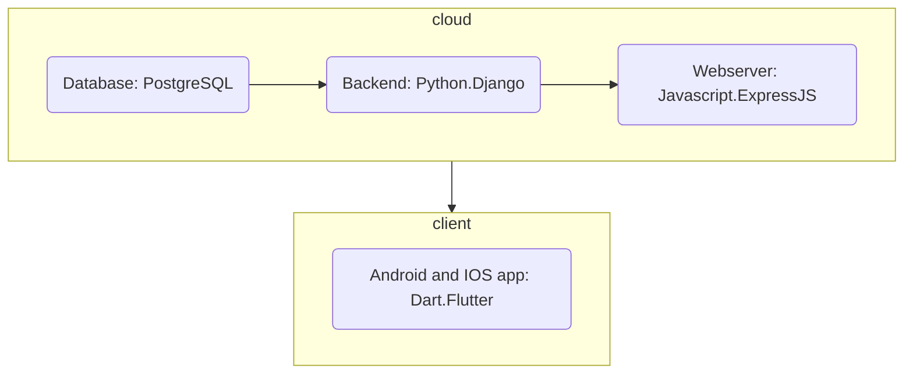

## 1.1 Latar Belakang

- because I see a lot of potential for the economic development of Indonesian society that has not been digitized, due to the 
lack of education and many misconceptions that technology (e-commerce) will kill UMKMs.
Therefore, I created this application called "LOKALII" as a platform so that all layers of traders in Indonesia can contribute to the country's economic turnover, namely by selling on one platform of domestic origin, by the children of the country and for the children of this country.
- To achieve the effectiveness of the industrial revolution 4.0 and the golden Indonesia 2045, economic activists (referred to here as traders) must be open, accustomed to, and understand information technology instead of closing themselves off from the system.
- And for the buyer's side, it will be facilitated because the "LOKALII" application is a social media-based app, which will include recommendations for goods, contents, and services as another function of social media, namely a platform for daily cyberspace interaction between communities.
- Because the main purpose of the "LOKALII" application is economic development, we are very concerned about
how the financial flow of each individual, both sellers and buyers, can run smoothly. Therefore,
we also have one of the main features, namely cashflow management, which is a superior feature compared to other e-commerce. Why? because here both sellers and buyers can pay attention to how much they spend in a certain period of time, along with savings and their savings targets including other financial calculations.
- In the future, "LOKALII" will also facilitate transactions by introducing fintech systems, such as digital wallets that can store LOKALII tokens, money, and also support the paylater systems for ventures (seller features) and for paying goods (buyer features).

## 1.2. Deksripsi Teknologi Informasi

It is a social media-based e-commerce platform that has the following main features:
1. Cashflow management and financial planning
where the seller can record the stock of goods in the store along with the income and expenses of the store with their respective classifications
where buyers can track what products or services they are looking for, as well as their money expenditures and income, at any time they specify
2. content recommendation
content creators can do product marketing
Affiliates can create content to increase the visibility of the products sold
every store can create content
every user can buy products directly from passing posts 
the content algorithm will be adjusted to the interests of buyers and is search-based
Algorithms will recommend products with the best reviews, lowest prices, and closest location to the buyer according to their preferences.
3. social media-based (such as Instagram and TikTok shops)
each user can upload photos, videos, and short videos
each user can communicate with each other via chat
every user can upload stories
every user can recommend products
4. digital walllets
every user can deposit money that can be used in "LOKALII" products
every cash earned by the seller will go to the wallet 
every seller can withdraw their money with every banks that cooperates with "LOKALII"
5. Subscription method
to improve the product and shop exposure
to improve the influencer exposure

## 1.3. Branding

- Merk        : LOKALII
- Tagline     : when there's a will, there's a way!!
- Campaign    : as an application that provide ease of resources management and trades for every seller     
                inside the country and buyer by doing the social-media based e-commerce system.
- Targer user : business owner (preferrably small and rising business, corporates allowed)
              : active vendors, traders and producer
              : age 14-65+
              : influencer and marketing enthusiast
              : content creator
              : every layer of indonesian society
- UI UX Theme : easy
              : simple
              : interactive
              : light coloured
              : slight red, cream, grey, and black colouring
              : design inspiration taken from tokopedia and pinterest

## 2. User Story

as a | i want to | and so | priorities level
---- | ---- | ---- | ---- 
seller | manage my cashflow | -knowing how much money we made and how much we spent for capital | ⭐⭐⭐⭐⭐
seller | manage my stocks and market price of the product | -knowing when and what to restock with the normal market price | ⭐⭐⭐⭐
buyer | manage my spending | -knowing how much i've spend in a specific period of time based on my own notes | ⭐⭐⭐⭐⭐
buyer | making my own spending categories | -knowing which parts of spending cost me the biggest | ⭐⭐⭐⭐
seller | opening and digitalize my own store | -selling sellers product and empowering the economical cycle and making profits |  ⭐⭐⭐
buyer | buying stuff | -can support the local business, buying the needs and goods, spending money | ⭐⭐⭐
buyer and seller | budgetting the spending of the month | to limit ourself from being over comsuming etc |⭐⭐⭐⭐

## 3. Struktur Data

Cara membuat aneka macam bentuk grafik menggunakan mermaid.js bisa lihat di [https://mermaid.js.org/syntax/entityRelationshipDiagram.html](https://mermaid.js.org/syntax/entityRelationshipDiagram.html) 

## 4. Arsitektur Sistem

## 5. Teknologi, Library, dan Framework

bla bla bla

## 6. Desain User Experience dan User Interface

Bisa load image 

## 7. Demonstrasi Video

Link youtube nya

## 8. Bagaimana mesin komputasi dan sistem operasi berperan dalam produk teknologi informasimu ?

Link youtube nya di detik jawaban ini

## 9. Bagaimana algoritma, struktur data, dan bahasa pemrograman berperan dalam produk teknologi informasimu ?

Link youtube nya di detik jawaban ini

## 10. Bagaimana metode pengembangan perangkat lunak / Software Development Life Cycle berperan dalam produk teknologi informasimu ?

Link youtube nya di detik jawaban ini

## 11. Bagaimana database / sistem basis data berperan dalam produk teknologi informasimu ?

Link youtube nya didetik ini
